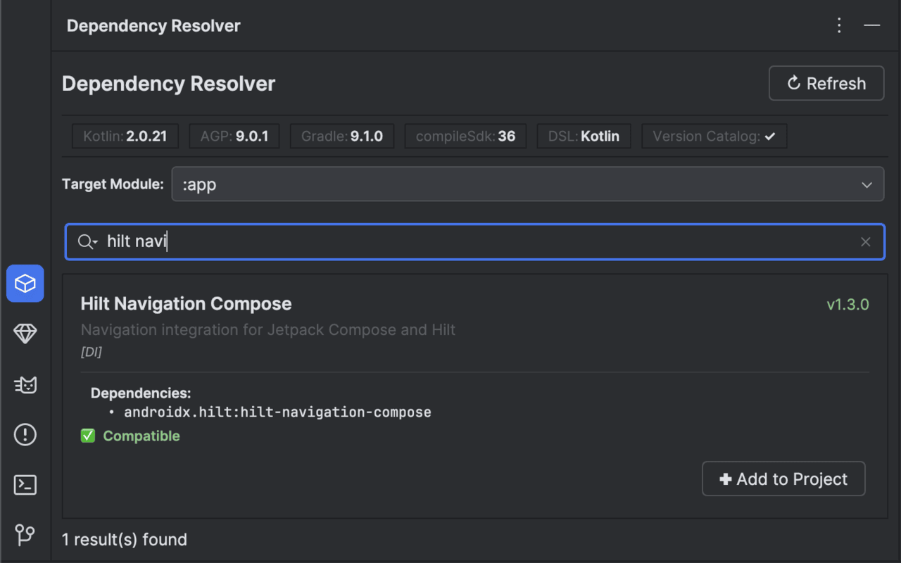

# DependencyResolver-Public

**Smart, one-click Android dependency management plugin for Android Studio and IntelliJ IDEA.**

## 📌 Overview 
Adding dependencies to an Android project is historically tedious. Developers have to:
1. Search Maven Central for the correct artifact coordinates.
2. Figure out the right compatibility version for your project's Kotlin, AGP, and SDK versions.
3. Manually add entries to `libs.versions.toml`, `build.gradle.kts`, and handle `ksp`/`plugin` configurations.

**Dependency Resolver completely automates this.** It operates via a dedicated IDE tool window, fetching a daily-updated remote knowledge base (via Cloudflare Pages) and recommending the perfectly compatible Library + Plugin versions based on your actual local setup.

---

## ✨ Features

- **Selective Dependency Injection** — interactively select exactly which optional components (e.g. `converter-gson` for Retrofit or `lifecycle-livedata-ktx` for Lifecycle) you want to include via checkboxes before injecting them.
- **Smart Partial Installation State** — seamlessly detects if you already have a subset of a library installed. The UI disables checkboxes for installed artifacts and dynamically changes the injection action to "Add Remaining", preventing duplicate entries.
- **Non-Intrusive Gradle Sync** — silently saves your build files in the background, allowing IntelliJ to natively prompt its "Sync Now" floating action button. This empowers you to comfortably batch-add multiple dependencies without being forced to wait for sequential Gradle syncs.
- **Auto-detects project config** — instantly reads your active Kotlin, AGP, Gradle, and compileSdk versions.
- **AGP 9.0+ Built-in Kotlin** — fully supports projects using AGP 9.0+ where the Kotlin compiler is bundled inside AGP with no explicit Kotlin plugin declaration. Detects the Kotlin version from a remotely-updated mapping table, with offline hardcoded fallback.
- **Intelligent Compatibility Engine** — guarantees the suggested version is compatible with your local Kotlin/AGP constraints, dynamically aligning compiler plugins (like KSP) and automatically falling back to an intelligent dynamic discovery engine for untracked library versions.
- **One-click insertion** — automatically generates and inserts entries into `[versions]`, `[libraries]`, and `[plugins]` in your TOML catalog, plus corresponding lines in your app's Gradle file.
- **Multi-module support** — a target module selector dropdown lets you inject dependencies into any module (`:app`, `:core:data`, `:feature:auth`, etc.) and perfectly preserves your selection across UI refreshes.
- **Supports both DSLs** — Kotlin DSL (`build.gradle.kts`) and Groovy DSL (`build.gradle`).
- **BOM support** — automatically uses `platform()` wrappers where required (e.g. Jetpack Compose, OkHttp, Koin, Ktor).

---

## 🚀 How to Use

### 1. Open the Tool Window
Open any Android project, then go to:
> **View → Tool Windows → Dependency Resolver**

The tool window appears at the bottom of the IDE alongside Logcat, Terminal, and Build.

### 2. Check Your Project Config
The **status bar** at the top instantly reads your environment. In the screenshot above, it detects:
- **Kotlin:** `2.2.0`
- **AGP:** `8.9.1`
- **Gradle:** `9.1.0`
- **compileSdk:** `36`
- **DSL:** `Kotlin`
- **Version Catalog:** `✓`

*(Click **↻ Refresh** on the far right to re-scan if you've recently changed your project config).*

### 3. Search for Libraries
Type a library name in the search field (e.g. `room` in the screenshot):
- `compose` → Jetpack Compose (BOM + UI + Material3)
- `retrofit` → Retrofit + Gson converter
- `room` → Room (runtime + KTX + KSP compiler)
- `hilt` → Hilt (Android + KSP compiler)
- `firebase` → Firebase BoM (Analytics, Crashlytics, Auth, Firestore, etc.)
- ...and 45+ more!

You can also search by category keywords like `networking`, `database`, `testing`, `di`, `image`.

### 4. Review Suggestions
Each result card gives you everything you need to know. For example, the `Room` card in the screenshot shows:
- **Library Name & Version:** `Room v2.6.4` (guaranteed to be compatible)
- **Description & Category:** SQLite mapping library `[DATABASE]`
- **Dependencies list:** Adds `room-runtime`, `room-ktx`, and `room-compiler`
- **Required plugins:** Adds the `com.google.devtools.ksp` plugin. *(Notice how the plugin dynamically aligned the KSP version to `2.2.0-1.0.28` to perfectly match the project's Kotlin `2.2.0` compiler!)*
- **Compatibility Status:** ✅ Compatible

### 5. Add to Project
Click **✚ Add to Project** to insert the dependency. The plugin will:

1. Add version entries to `[versions]` in `libs.versions.toml`
2. Add library entries to `[libraries]` in `libs.versions.toml`
3. Add plugin entries to `[plugins]` if needed
4. Add `implementation(libs.xxx)` lines to `app/build.gradle.kts`
5. Add `alias(libs.plugins.xxx)` to the plugins block if needed
6. Show a balloon notification confirming success
7. Trigger Gradle sync

> **Tip:** Use the **Target Module** dropdown above the search bar to choose which module receives the dependency. It defaults to `:app` but auto-discovers all modules in your project.

---

## 📦 Supported Libraries

| Category | Libraries |
|---|---|
| **UI** | Jetpack Compose (BOM), Material Components |
| **Networking** | Retrofit, OkHttp (BOM), Ktor Client (BOM) |
| **Database** | Room (w/ KSP), DataStore |
| **DI** | Hilt (w/ KSP), Koin (BOM) |
| **Backend** | Firebase (BOM & all modules), Apollo GraphQL |
| **Architecture** | Navigation, Lifecycle, Paging, WorkManager, Fragment KTX, Activity KTX, App Startup |
| **Image Loading** | Coil, Glide (w/ KSP) |
| **Serialization** | Kotlinx Serialization, Moshi (w/ KSP), Gson |
| **Async / Utility** | Kotlin Coroutines, Timber, LeakCanary, Arrow, Browser, Palette, KSP |
| **Media / Animation** | CameraX, Media3 / ExoPlayer, Lottie |
| **Security** | Security Crypto, Biometric |
| **Testing** | JUnit, MockK, Truth, Espresso, Turbine, Robolectric |

---

## 📋 Requirements

- Android Studio Ladybug (2024.2) or newer
- IntelliJ IDEA 2024.2+

---

## 📬 Contact & Support

Developed by **Abdulkadir Ali**

Have a question, suggestion, or feature request? Reach out at:
📧 [abdulkadir.ali@live.in](mailto:abdulkadir.ali@live.in)
